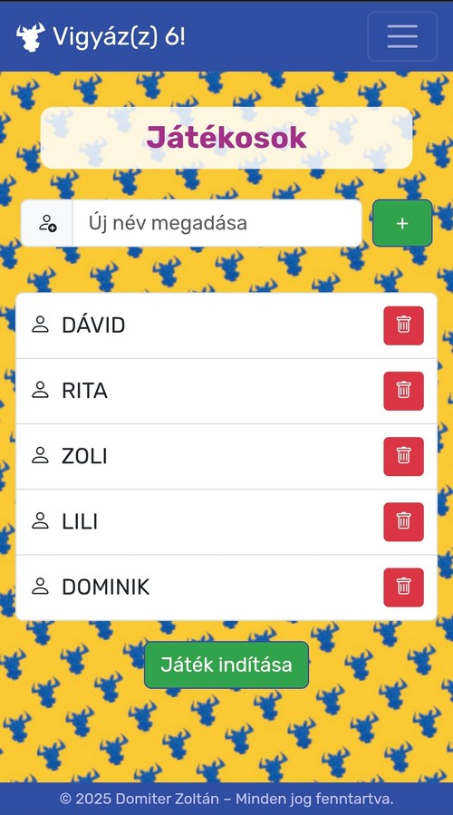
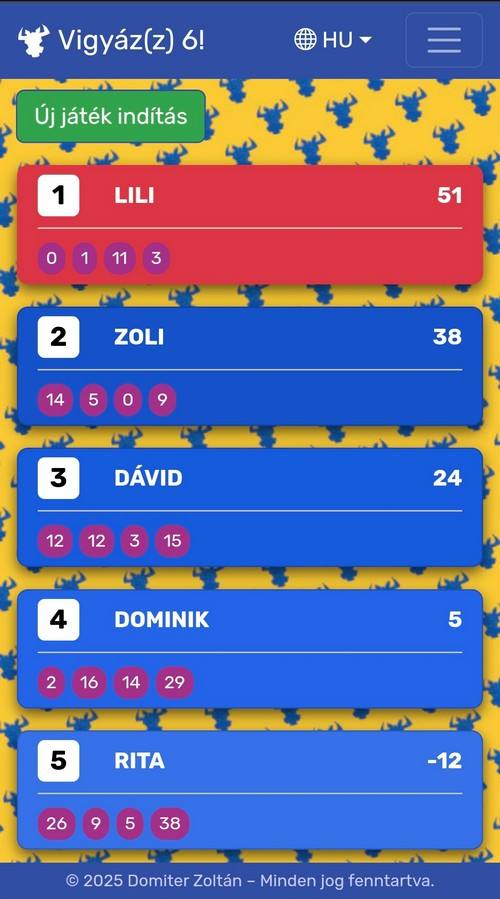
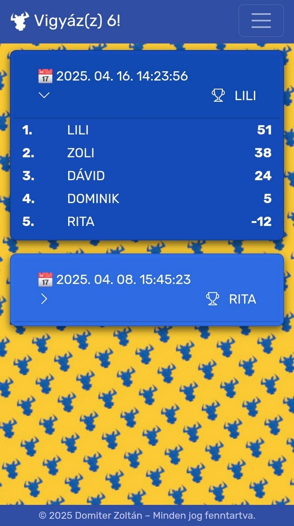

# Vigyáz(z) 6! – Score Keeper

**English** | [Magyar](README.hu.md)

A lightweight web app that keeps score for the **Vigyázz 6!** card game (known internationally as *6 nimmt!* / *Take 6!*). Record the bull heads each player collects round by round, and the app calculates the standings, spots the end of the game, highlights the winner and saves the result.

No installation, no account, no server: it runs in the browser and stores everything locally on your device.

<p align="center">
  
  &nbsp;
  
  &nbsp;
  
</p>

## Features

- **Player management** – add and remove players before the game starts (at least 2 players are required).
- **Round-by-round scoring** – every player starts with 66 points; after each round you enter the number of bull heads each player took (0–171), and it is deducted from their score.
- **Live ranking** – players are sorted by score after every round, tied players share the same rank, and each card shows the points of all previous rounds.
- **Automatic game end** – the game ends as soon as someone reaches 0 or goes below it; the leader is highlighted as the winner.
- **History** – finished games are saved automatically with date, time, winner and full final standings.
- **Built-in rules** – the game rules are available inside the app.
- **Multilingual** – Hungarian, English and German interface.
- **Mobile-first** – responsive layout, optimised for phones so it can sit on the table during play.

## Privacy

The app has no backend. Players, scores and game history are stored only in your browser's `localStorage`; nothing is sent to or received from a server, and no personal or sensitive data is processed. Clearing your browser data also deletes the saved games.

The only external requests are for static assets (Bootstrap, Bootstrap Icons and the Rubik font from public CDNs).

## Tech stack

- TypeScript (compiled to ES modules)
- HTML5, CSS3
- [Bootstrap 5.3](https://getbootstrap.com/) and [Bootstrap Icons](https://icons.getbootstrap.com/)
- Browser `localStorage` for persistence

No framework and no bundler – just static files.

## Running locally

1. Clone the repository:
   ```bash
   git clone https://github.com/zdomiter/vigyazz6_web.git
   cd vigyazz6_web
   ```
2. Serve the folder with any static web server, for example:
   ```bash
   npx serve .
   ```
   or use the *Live Server* extension in VS Code.
   Opening `index.html` directly via `file://` will not work, because browsers block ES module imports from the local file system.
3. If you modify the `.ts` files, recompile them:
   ```bash
   npx tsc
   ```

## Project structure

| File | Purpose |
|------|---------|
| `index.html`, `game.ts` | Game screen: rounds, scoring, ranking, end of game |
| `player.html`, `player.ts` | Adding and removing players |
| `history.html`, `history.ts` | Saved results of previous games |
| `game_rules.html` | Game rules |
| `user.ts` | Player model |
| `storage.ts` | Reading and writing `localStorage` |
| `language.ts`, `lang/` | Translations and language switching |
| `style.css` | Custom styles and animations |

## Disclaimer

This is an unofficial fan-made helper app. *6 nimmt!* is a card game designed by Wolfgang Kramer and published by AMIGO; all related trademarks belong to their respective owners.

## Author

© 2025 Domiter Zoltán – All rights reserved.
